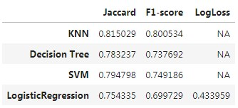

### IBM Data Science Professional Certificate.
#### Coursera Course ML0101EN. Machine Learning with Python
https://www.coursera.org/learn/machine-learning-with-python

Final project of IBM's course with a simple comparison between KNN,SVM,Decision Tree and Logistic Regression models on a given data set of loans records.

Final results :rocket::

